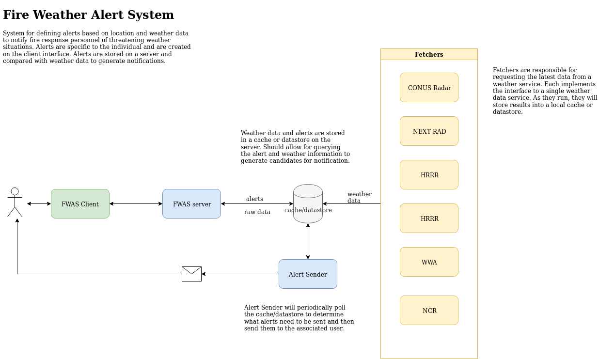

# Fire Weather Alert System (FWAS)

System for defining alerts based on location and weather data to notify fire response 
personnel of threatening weather situations. Alerts are specific to the individual 
and are created on the client interface. Alerts are stored on a server and 
compared with weather data to generate notifications.

## Design

## Installation

TBD

## Usage

TBD

## Contributing

TBD
